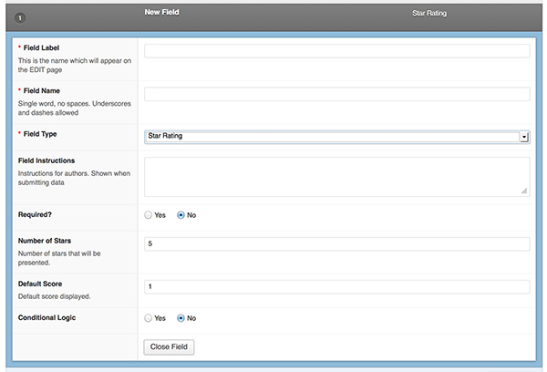
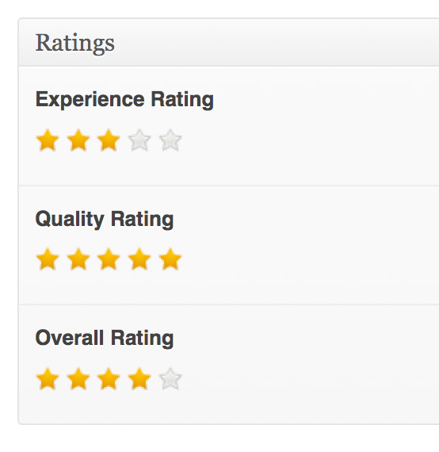

# ACF Star Rating Field/s #
Contributors: jconroy    
Tags: acf, ratings, custom field   
Requires at least: 3.5  
Tested up to: 3.5  
Stable tag: 1.0

Adds a 'star-rating' field type for the [Advanced Custom Fields](http://wordpress.org/extend/plugins/advanced-custom-fields/) WordPress plugin.

## Description ##

Adds a 'star-rating' field type for the [Advanced Custom Fields](http://wordpress.org/extend/plugins/advanced-custom-fields/) WordPress plugin. 

This plugin is intended to help with people writing reviews that want a nice interface for doing rating/scores within the dashboard. This plugin does NOT DISPLAY STARS on the front end of your site. 

We recommend creating a custom widget, customising your theme etc to display ratings however you choose using something like http://wbotelhos.com/raty

## Compatibility ##

This add-on will work with:

* version 4 and up of ACF

## Installation ##

This add-on can be treated as both a WP plugin and a theme include.

**Install as Plugin**

1. Copy the 'acf-field-star-rating' folder into your plugins folder
2. Activate the plugin via the Plugins admin page

**Include within theme**

1.	Copy the 'acf-field-star-rating' folder into your theme folder (can use sub folders). You can place the folder anywhere inside the 'wp-content' directory
2.	Edit your functions.php file and add the code below (Make sure the path is correct to include the acf-star_rating.php file)

```php
add_action('acf/register_fields', 'my_register_fields');

function my_register_fields()
{
	include_once('acf-field-star-rating/acf-star_rating.php');
}
```

## Usage ##

This plugin actually adds a standard star rating field and an average star rating field that automatically generates the average score based on other standard star rating fields in the field group. This is useful for storing over all ratings if there a few rating criteria are being used.

**Standard Star Rating Field**

1. Add a new field with a Field Type of "Star Rating".
2. Set the "Number of Stars" that will be displayed to choose e.g. 5 from along with the default rating e.g. Screenshot 1 below.
3. Publish the field / group as per ACF standard use. When viewing the group on the post edit screen the "Star Rating" field will now be available e.g. Screenshot 2 below.

**Average Star Rating Field**

1. Add a number of the standard "Star Rating" fields as per above.
2. Add a new "Star Rating Average" field.
3. Set the "Number of Stars" that will be displayed to match the number set for the standard star ratings fields.
4. Publish the field / group as per ACF standard use. When viewing the group on the post edit screen the "Star Rating Average" field will now auto populate the average star score based on the other standard star rating fields in the same group. e.g. Screenshot 3 below.

**Retrieve Ratings**

1. Retrieve the ratings by using standard ACF functions for obtaining field values.


## Screenshots ##







## Changelog ##

### 1.0 ###
* Initial release